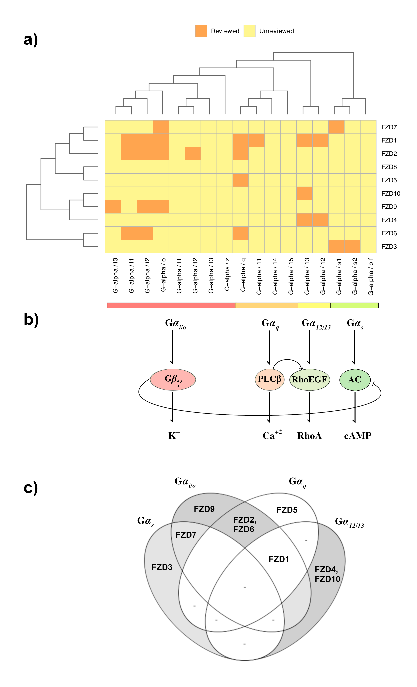
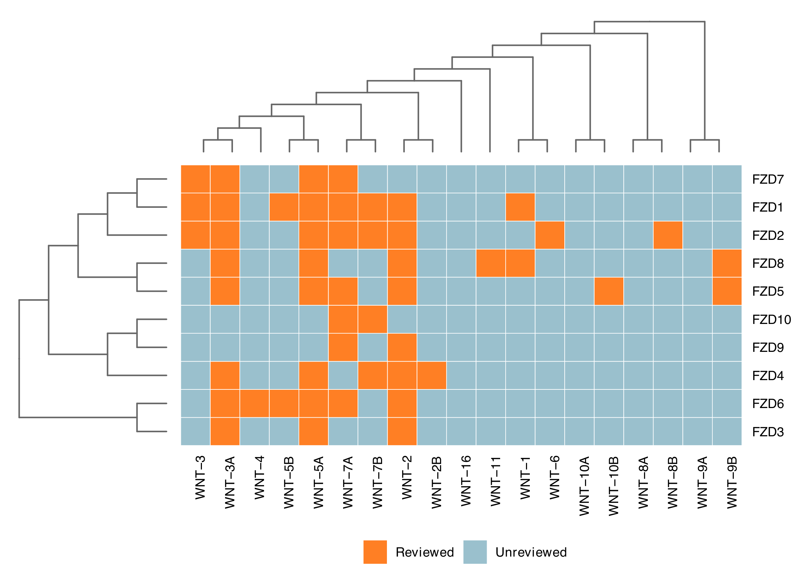

FZD-g_alpha_interactions
========================

library(ggtree)
library(tidyverse)
library(reshape2)
library(patchwork)
library(gdata)

setwd("~/Users/islekbro/Desktop/Rstudio/interactions/fzd-gα/")

preabDat <- read_csv("interactions_binary.csv")

#premat <- as.matrix(preabDat)
#rownames(premat) <- preabDat$X1
#premat <- premat[1:nrow(premat),2:ncol(premat)]
#matCite <- matrix(nrow = nrow(premat), ncol = ncol(premat))
#rownames(matCite) = rownames(premat)
#colnames(matCite) = colnames(premat)
#
#for (i in 1:nrow(premat)){
#  for (j in 1:ncol(premat)){
#    if (premat[i,j] == 1){
#      matCite[i,j] <- round(runif(1, min = 0, max = 100),digits = 0)
#    }
#  }
#}
#
#dfCite <- as.data.frame(matCite)
#dfCite$X1 <- preabDat$X1
#dfCite <- read_csv("interactions.csv")
dfCite <- read_csv("citedat.csv")

ordFZD <- c("FZD7","FZD1","FZD2","FZD8","FZD5","FZD10","FZD9","FZD4","FZD6","FZD3")

ordwnt <- c("G-alpha / i3","G-alpha / i1","G-alpha / i2","G-alpha / o","G-alpha / t1","G-alpha / t2","G-alpha / t3","G-alpha / z","G-alpha / q","G-alpha / 11","G-alpha / 14","G-alpha / 15","G-alpha / 13","G-alpha / 12","G-alpha / s1","G-alpha / s2","G-alpha / olf")

preabDat.m <- melt(preabDat)
dfCite.m <- melt(dfCite, id.vars = "A")

preabDat.m <- merge.data.frame(preabDat.m, dfCite.m,by = c("A", "variable"))
preabDat.m$variable <- reorder.factor(preabDat.m$variable, new.order=ordwnt)
preabDat.m$A <- reorder.factor(preabDat.m$A, new.order=rev(ordFZD))

preabDat.m <- preabDat.m %>%
  arrange(variable,A) 

pTile <- ggplot(preabDat.m, aes(variable,A,fill = ifelse(value.x == 0, "Unreviewed", "Reviewed"))) +
  geom_tile(color = "gray70", size = 0.2) +
  #geom_text(aes(label = value.y), color = "gray20", size = 2)+
  scale_fill_manual(name = "", values = c("tan1","khaki1")) +
  scale_y_discrete(position = "right") +
  theme_minimal() +
  theme(axis.title = element_blank(), axis.text.x = element_text(angle = 90, hjust = 1), 
        axis.text = element_text(face = "bold", colour = "black", vjust = 0.5),#axis.text.y = element_blank(),
        axis.ticks = element_blank(), panel.grid = element_blank(), 
        plot.margin=margin(t = 0, l = 0), legend.position = "bottom", 
        legend.text = element_text(face="bold")) ; pTile

dend1 <- read.tree("FZDs_tree.nw")
dend2 <- read.tree("G-alpha-guidetree.nw")

pDend1 <- ggtree(dend1,branch.length = "none", color="gray40") + 
  #geom_nodepoint(color="#b5e521", alpha=1/3, size=5) + 
  theme(plot.margin=margin(r = -0.3, l = -0.3,unit = "cm")) #+ 
  #geom_tiplab() 
  #xlim(NA, 8) #+ geom_text(aes(label=node))

pDend2 <- ggtree(dend2,branch.length = "none",color="gray40")  + 
  layout_dendrogram() + scale_y_reverse() + 
  theme(plot.margin=margin(r = 0, l = 0,unit = "cm"))#+ geom_tiplab(angle = 90,hjust = 1)  #+ scale_x()# + xlim(NA, 25)

design <-  "#########
            #########
            ##AAAAAAA
            BBCCCCCCC
            BBCCCCCCC"

wr <- wrap_plots(A = pDend2, B = pDend1, C = pTile, design = design); wr

ggsave("fzd-galpha_interactions1.pdf", height = 8.31, width = 7.72, wr, dpi = 300, device = "pdf")

FZD-WNT_interactions
====================

SANKEY
======

Tree
====

